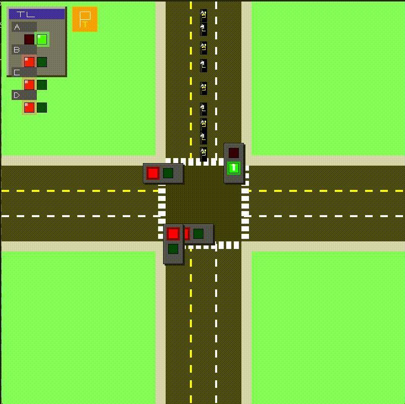

# 🚥 TRAFFIC JUNCTION SIMULATOR 🚥

> *An advanced queue-based traffic management solution for complex intersections*



## 🔄 SYSTEM OVERVIEW

This innovative project creates a lifelike simulation of urban traffic flow, where vehicles navigate through a controlled intersection following sophisticated traffic signals and lane-specific protocols, demonstrating the elegance of queue data structures in practical applications.

### ⚡ CORE CAPABILITIES

- **`INTELLIGENT QUEUE MANAGEMENT`**: Harnessing linear data structures to resolve intricate traffic patterns
- **`SPECIALIZED LANE TYPES`**:
  - <kbd>STANDARD LANES</kbd>: Function according to traditional traffic signal cycles
  - <kbd>PRIORITY LANE (A2)</kbd>: Gains traffic priority when occupied by >10 vehicles, until capacity falls <5
  - <kbd>EXPRESS LANES (L3)</kbd>: Allows continuous left turns independent of signal states
- **`SMART SIGNAL TIMING`**: Duration intelligently adjusted based on current vehicle distribution
- **`FLUID VEHICLE DYNAMICS`**: Enhanced queueing mechanics with realistic movement patterns


## 🔬 TECHNICAL ARCHITECTURE

The simulation framework incorporates these foundational components:

### 📊 `DATA STRUCTURES`
- <ins>**Base Queue System**</ins>: FIFO implementation handling vehicle sequencing within lanes
- <ins>**Enhanced Priority Queue**</ins>: Manages lane precedence with variable priority values
- <ins>**Navigation Framework**</ins>: Controls vehicle routing through intersection nodes

### 🧩 `ALGORITHMIC FOUNDATIONS`
- <ins>**Signal Timing Formula**</ins>: `Total time = |V| * t` where:
  - `|V|` = Weighted average of waiting vehicles = `(1/n) * Σ|Li|`
  - `n` = Total standard lane count
  - `t` = Vehicle processing interval (2 seconds)
- <ins>**Adaptive Priority System**</ins>: Lane A2 automatically escalates to maximum priority upon exceeding 10 vehicles until reducing below threshold of 5
- <ins>**Continuous Flow Processing**</ins>: Lane 3 maintains perpetual left-turn capability regardless of current signal phase

## 🛠️ SYSTEM REQUIREMENTS

- C++17 compatible compiler (GCC 8+, Clang 7+, MSVC 19.14+)
- CMake 3.15 or later
- SDL3 library

## 🏭 BUILD INSTRUCTIONS

### SDL3 Installation Guide

As SDL3 continues active development and isn't widely available in standard repositories, source compilation is recommended:

#### Linux
```bash
# Install development tools
sudo apt-get update
sudo apt-get install build-essential git cmake

# Clone SDL3
git clone https://github.com/libsdl-org/SDL.git -b SDL3
cd SDL

# Build and install
mkdir build && cd build
cmake .. -DCMAKE_BUILD_TYPE=Release
make -j$(nproc)
sudo make install
```

#### macOS
```bash
# Using Homebrew
brew install cmake git

# Clone SDL3
git clone https://github.com/libsdl-org/SDL.git -b SDL3
cd SDL

# Build and install
mkdir build && cd build
cmake .. -DCMAKE_BUILD_TYPE=Release
make -j$(sysctl -n hw.ncpu)
sudo make install
```

#### Windows
```powershell
# Clone SDL3
git clone https://github.com/libsdl-org/SDL.git -b SDL3
cd SDL

# Build with Visual Studio
mkdir build && cd build
cmake .. -DCMAKE_BUILD_TYPE=Release -G "Visual Studio 17 2022" -A x64
cmake --build . --config Release

# Install (run as administrator)
cmake --install . --config Release
```

Alternatively, compile SDL3 and place it within a `libs/SDL3_install` directory in your project (path configured in CMakeLists.txt).

### Simulator Build Process

#### Linux/macOS
```bash

git clone https://github.com/Giri-2061/dsa-queue-simulator.git
cd dsa-queue-simulator
mkdir build && cd build
cmake ..
make -j$(nproc)
```

#### Windows
```powershell
git clone https://github.com/Giri-2061/dsa-queue-simulator.git
cd dsa-queue-simulator
mkdir build && cd build
cmake .. -G "Visual Studio 17 2022" -A x64
cmake --build . --config Release
```

## 🚀 EXECUTION GUIDE

Both components must run simultaneously:

1. Open two terminal instances
2. In terminal one, launch the traffic generator:
   ```bash
   # Linux/macOS
   ./bin/traffic_generator
   
   # Windows
   .\bin\Release\traffic_generator.exe
   ```
3. In terminal two, execute the simulator:
   ```bash
   # Linux/macOS
   ./bin/simulator
   
   # Windows
   .\bin\Release\simulator.exe
   ```

## 📋 PROJECT ARCHITECTURE

```
dsa-queue-simulator/
├── CMakeLists.txt          # CMake build configuration
├              
│── dsa.gif           # Demonstration animation
├── include/                # Header files
│   ├── core/               # Core simulation components
│   │   ├── Constants.h     # Simulation constants
│   │   ├── Lane.h          # Lane management
│   │   ├── TrafficLight.h  # Traffic light control
│   │   └── Vehicle.h       # Vehicle entity
│   ├── managers/           # Management classes
│   │   ├── FileHandler.h   # File communication
│   │   └── TrafficManager.h# Traffic flow control
│   ├── utils/              # Utility classes
│   │   ├── DebugLogger.h   # Logging system
│   │   ├── PriorityQueue.h # Priority queue implementation
│   │   └── Queue.h         # Basic queue implementation
│   └── visualization/      # Visualization components
│       └── Renderer.h      # SDL3 renderer
└── src/                    # Source implementations
    ├── core/               # Core components implementation
    │   ├── Lane.cpp
    │   ├── TrafficLight.cpp
    │   └── Vehicle.cpp
    ├── managers/           # Manager implementations
    │   ├── FileHandler.cpp
    │   └── TrafficManager.cpp
    ├── utils/              # Utility implementations
    │   └── DebugLogger.cpp
    ├── visualization/      # Visualization implementations
    │   └── Renderer.cpp
    ├── main.cpp            # Simulator main program
    └── traffic_generator.cpp # Traffic generator program
```

## 📝 ACADEMIC IMPLEMENTATION SPECIFICATIONS

This project satisfies these requirements for COMP202 Assignment #1:

1. **`LINEAR DATA STRUCTURE IMPLEMENTATION`**:
   - Robust Queue implementation for comprehensive vehicle management
   - Advanced Priority Queue for sophisticated lane prioritization
   
2. **`TRAFFIC FLOW SCENARIOS`**:
   - Normal Operation: Balanced vehicle service across lanes during standard conditions
   - Priority Response: Lane A2 receives immediate priority when threshold of >10 vehicles is reached
   
3. **`LANE CONFIGURATION`**:
   - L1: Entry lane (primary point for vehicle introduction from external roads)
   - L2: Regulated lane following traffic signal protocols (supporting forward and left movements)
   - L3: Express lane allowing continuous left turns regardless of active signal phase
